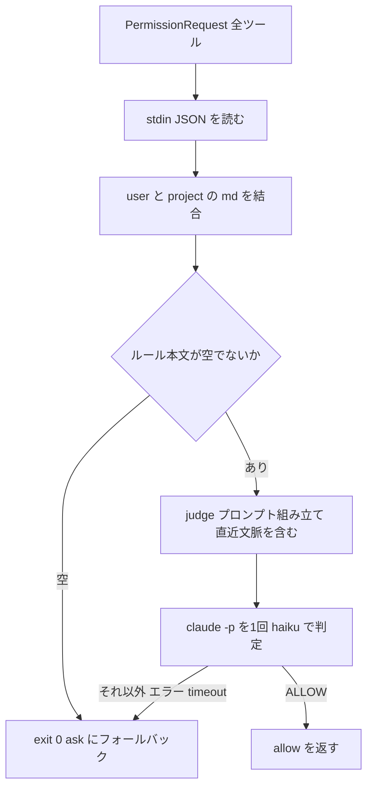

# permission-gate

**`PermissionRequest` フック**で、全ツール（Bash / MCP / Write / Edit …）の許可ダイアログが表示される直前に `claude -p`（別プロセスの Claude, 既定 `haiku`）を1回だけ呼び、**ユーザーが自然言語で書いた許可ルール**に照らして「この操作を自動許可してよいか」を判定するプラグインです。ルールに明確に合致し安全と判断できた操作だけを `behavior: "allow"` で自動許可し、それ以外・判定不能・エラー・タイムアウトはすべて従来の確認ダイアログにフォールバックします。

静的な allowlist では、コマンド・引数・パス・文脈が無限に変化する操作（読み取り専用 Bash、副作用のない MCP 呼び出し、明示的に依頼された `.claude/` 配下への Write など）を網羅できません。permission-gate は判定基準を固定プロンプトに閉じ込めず、**設定ファイルの自然言語ルール**に委ねることで、プロジェクト固有の許可条件まで表現できます。

## しくみ

1. `PermissionRequest` イベント（`matcher: "*"` ＝全ツール対象）で、フックが stdin から `{ tool_name, tool_input, cwd, transcript_path, ... }` を受け取る
2. ユーザーグローバルとプロジェクトの `permission-gate.md` を読み、存在するものを**グローバル → プロジェクトの順**で結合する。**どちらも無ければ `claude -p` を呼ばず即フォールバック**（無設定プロジェクトへの影響はゼロ）
3. `transcript_path` から直近のユーザー発言を数件抽出し（「明示的に依頼されたか」の判断材料）、許可ルール・対象操作（`tool_name` と `tool_input` の JSON）・直近文脈をまとめた判定プロンプトを組み立てる
4. `claude -p --model haiku --setting-sources "" --strict-mcp-config` を1回だけ起動して判定させる
   - `--setting-sources ""` が重要: 子 `claude` でこのフック自身が再発火する無限ループを防ぐ（フック無効化）
5. judge が **`ALLOW` の1語だけ**を返したときだけ `{ hookSpecificOutput: { hookEventName: "PermissionRequest", decision: { behavior: "allow" } } }` を出力する。それ以外（`ASK`・空・想定外の出力・非ゼロ終了・タイムアウト）は**何も出力せず `exit 0`**（従来の確認ダイアログが出る）
6. フック本体は決してクラッシュしない（誤許可より確認を優先する安全側の設計）



## 設定ファイル

各スコープに **単一の Markdown ファイル**を置きます。frontmatter は不要で、本文がそのまま自然言語の許可ルールです。ルールの構文解析はせず、自然言語のまま judge に解釈させます（各条件が独立した許可ルールとして OR で評価される）。

| スコープ | パス | 用途 |
| --- | --- | --- |
| ユーザーグローバル | `~/.claude/permission-gate.md` | 全プロジェクト共通の許可ルール（例: 読み取り専用 Bash） |
| プロジェクト | `<projectRoot>/.claude/permission-gate.md` | そのプロジェクト固有の許可ルール |

- 両方あれば本文を**グローバル → プロジェクトの順**で結合して judge に渡します（プロジェクト側が後に来る）。どちらか一方だけでも動作します。
- プロジェクトルートは `cwd` から `.claude` / `.git` を辿って特定します。

### 設定例（`~/.claude/permission-gate.md`）

```markdown
# 自動許可してよい操作

- 読み取り専用の Bash コマンド（ls, cat, git status, git log, grep, rg, find など。副作用なし）
- 副作用のない読み取り専用の MCP 呼び出し（mcp__deepwiki__* など）
- 直近のユーザー指示で明示的に依頼された .claude/ 配下への Write / Edit
```

## インストール

```
/plugin marketplace add aki77/claude-plugins
/plugin install permission-gate@plugin-hub
```

インストール後、上記いずれかの `permission-gate.md` を用意すると有効になります（設定ファイルが無ければ何も起きません）。

## 前提

- `claude` CLI がインストール済みで PATH から実行できること（judge の実行に使用）。実行できない場合、フックは何もせず `exit 0` で終了し、従来の確認ダイアログにフォールバックします。
- Node.js（Claude Code の動作要件に含まれるため追加インストール不要）。

## 環境変数

| 変数 | 既定 | 説明 |
| --- | --- | --- |
| `PERMISSION_GATE_MODEL` | `haiku` | judge に使う `claude -p` のモデル |
| `PERMISSION_GATE_TIMEOUT` | `20`（秒） | `claude -p` のタイムアウト（秒指定）。超過は ask フォールバック。`hooks.json` の `timeout`（25 秒）はこれより余裕を持たせてある |
| `PERMISSION_GATE_DEBUG` | 未設定（ログ無効） | 真の値を設定するとステップログを出力する |
| `PERMISSION_GATE_DEBUG_FILE` | OS の temp ディレクトリ | デバッグログの出力先。既定は `<tmpdir>/permission-gate-debug.log` |

## トレードオフ・既知の制限

- **`deny` は返しません。** 役割は「安全なものを素通しする」ことだけで、拒否は既存の許可フローに委ねます。判定できないものはすべて `ask`（従来の確認ダイアログ）に落ちます。
- **1 操作につき 1 回 `claude -p` を起動します**（ダイアログを消す対価）。設定ファイルが無ければ起動しないため、無設定プロジェクトへの影響はゼロです。速度が問題になる場合はキャッシュ等の拡張を検討してください。
- 判定は judge（`haiku`）の解釈に依存します。誤許可より確認を優先する設計のため、judge が少しでも迷えば `ask` に落ちます。
- `hooks.json` はセッション起動時に読み込まれるため、プラグインをアップデートしても実行中のセッションには反映されません。反映するには Claude Code を再起動してください。

## 関連プラグイン

- [`plan-preview`](../plan-preview) — 同じ `PermissionRequest` フックを使い、ExitPlanMode の承認ダイアログ直前にプランファイルをブラウザで開く（判定には干渉しない）。
- [`compact-handoff`](../compact-handoff) — 本プラグインと同じ `claude -p`（別プロセスの Claude）呼び出し方式を採用している。
